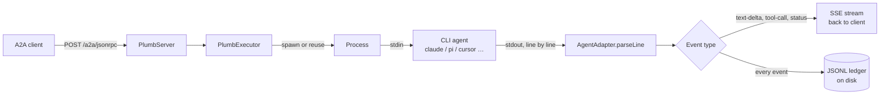

# plumb

*Quiet pipes for noisy agents.*

[](https://github.com/kariemSeiam/plumb/actions/workflows/ci.yml)
[](https://www.npmjs.com/package/plumb-bridge)
[](LICENSE)
[](https://bun.sh)

Plumb wraps CLI coding agents into [A2A](https://google.github.io/A2A/) HTTP servers. It spawns a subprocess, reads its stdout, writes JSONL, and exits. One command. One ledger. Eight adapters. Zero dashboards.

**[Try it](#try-it) · [What it refuses](#what-plumb-refuses) · [What it bets on](#what-plumb-bets-on) · [Fleet](#fleet) · [Adapters](#adapters) · [Surface](#surface) · [Setup](#setup) · [FAQ](#faq)**

---

## How it works



Plumb does not generate text. It does not decide. It does not remember. It moves bytes from one process to another and records what happened.

---

## Try it

```bash
# Terminal 1 — wrap even `cat` as an A2A agent
plumb wrap cat --port 3001

# Terminal 2 — send a task
curl -X POST http://localhost:3001/a2a/jsonrpc \
  -H "Content-Type: application/json" \
  -d '{
    "jsonrpc": "2.0", "id": "1", "method": "message/send",
    "params": {
      "id": "demo",
      "message": { "role": "user", "parts": [{ "type": "text", "text": "Hello" }] }
    }
  }'
```

The SSE stream returns:

```text
event: task_lifecycle_notification
data: {"kind":"task","id":"demo","status":{"state":"working"}}

event: artifact_update
data: {"kind":"artifact-update","artifact":{"parts":[{"type":"text","text":"Hello\n"}]}}

event: task_lifecycle_notification
data: {"kind":"message","id":"demo"}
```

The ledger records everything, independently of whether the client stayed connected:

```bash
cat .plumb/ledger/$(date +%Y-%m-%d).jsonl | jq '.'
```

```jsonl
{"type":"task_submitted","taskId":"demo","cli":"cat","message":"Hello"}
{"type":"task_running","taskId":"demo"}
{"type":"progress","taskId":"demo","text":"Hello\n"}
{"type":"task_completed","taskId":"demo"}
```

---

## What plumb refuses

Instead of adding a feature, most bridges eventually grow one of these. Plumb names each refusal and the boundary it protects — full reasoning in [REFUSALS.md](docs/soul/REFUSALS.md).

| Instead of… | Plumb does… | Why |
|---|---|---|
| A dashboard | Returns `200` or `400` | Health is binary. A chart adds nothing to that signal. |
| Orchestration | Routes by label, assigned by the operator | Plumb doesn't know what a task requires or what an agent can do. The operator decides. |
| An LLM call | Spawns a subprocess and reads stdout | Transport layer, not an intelligence layer. |
| A plugin system | One fixed adapter contract | Changing it requires a commit and a test run, not a marketplace. |
| Learned memory | An append-only ledger | The ledger records. It does not summarize or cross-reference. A separate process can. |
| Process supervision | Executes the task, then exits | `systemd` restarts crashed processes better than Plumb ever will. |
| A managed platform | Ships on npm, source on GitHub | No hosted service, no extension registry, nothing to keep alive beyond the pipe. |

---

## What plumb bets on

Every non-trivial choice below is a bet with a stated failure condition, not a claimed best practice — full ADRs with honest edges in [DESIGN.md](DESIGN.md).

| Decision | Choice | Fails when |
|---|---|---|
| Ledger | Append-only JSONL, daily rotation, `jq`/`DuckDB` to query | 10K+ tasks/day without an external index; schema drift across versions with no `version` field |
| Runtime | Bun (`Bun.spawn`, built-in test runner, no `tsc` step) | An npm dependency needs native bindings Bun can't resolve, or you must deploy somewhere Node-only |
| Streaming | A2A over SSE, not WebSocket | Client disconnects during the final event and never sees `task_completed` — must reconcile from the ledger |
| Delivery | Fire-and-forget; ledger writes are synchronous (`appendFileSync`) | High concurrency + large outputs turns the synchronous write into the hot-path bottleneck |
| Config | YAML (`plumb.yaml`) | Type coercion, anchors, tab-vs-space errors — `plumb fleet validate` exists specifically to catch these before boot |

---

## Fleet

Declare multiple agents once, boot them together.

```yaml
# plumb.yaml
version: "1"
agents:
  - id: claude
    cli: claude
    port: 3000
  - id: cursor
    cli: cursor-agent --print
    port: 3003
  - id: wolfy
    cli: wolfy
    port: 3007
    mode: persistent
    timeout: 600
```

```bash
plumb fleet validate   # check config, detect adapters
plumb fleet up         # boot all
plumb fleet status     # health check all
```

Full schema and lifecycle: [FLEET.md](docs/FLEET.md).

## Adapters

Eight protocol parsers, one contract.

| Adapter | CLI | Mode | Protocol |
|---|---|---|---|
| Echo | `cat` | oneshot | text |
| Pi | `pi` | persistent | JSONL-RPC |
| Wolfy 🐺 | `wolfy` | persistent | JSONL-RPC |
| Claude | `claude` | oneshot | stream-json |
| Cursor | `cursor-agent` | oneshot | stream-json |
| OpenCode | `opencode` | oneshot | json-stream |
| VENOM | `venom` | oneshot | stream-json |
| Generic | any | oneshot | text |

<details>
<summary>The contract every adapter implements (four methods, no more)</summary>

```typescript
interface AgentAdapter {
  readonly id: string;
  readonly binary: string;
  readonly tier: 1 | 2 | 3;
  readonly mode: 'oneshot' | 'persistent';

  buildArgs(task: AgentTask, config: PlumbConfig): string[];
  formatInput(task: AgentTask): string;
  parseLine(line: string): AdapterEvent[];
  detect(): Promise<DetectionResult | null>;
}
```

The binary registry matches by process name; `generic` is the implicit fallback for anything undetected. Full contract and how to add a ninth adapter: [ADAPTERS.md](docs/ADAPTERS.md).

</details>

## Surface

| Method | Path | Auth |
|---|---|---|
| GET | `/.well-known/agent-card.json` | public |
| GET | `/.well-known/agent.json` | public (redirect) |
| GET | `/health` | public |
| POST | `/a2a/jsonrpc` | Bearer (if configured) |
| * | `/a2a/rest` | Bearer (if configured) |

## Setup

```bash
# Install
bun add -g plumb-bridge

# Run the test suite
bun test

# Run locally
plumb wrap cat --port 3001
```

Requires Bun >= 1.1.0.

---

## Project

```text
src/
  core/
    executor.ts        Task dispatch, INK validation, event routing, ledger
    process.ts          ProcessManager + PersistentProcess
    server.ts            Express + A2A SDK, auth, Agent Card
    ledger.ts             Append-only JSONL writer
    task-store.ts          LRU + TTL bounded task memory
    session-store.ts        Cursor multi-turn session tracking
  adapters/            8 adapters + binary registry
  types.ts               AdapterEvent, LedgerEvent, AgentAdapter
  cli.ts                    plumb wrap, fleet commands
docs/
  DESIGN.md             Architecture Decision Records with honest edges
  ARCHITECTURE.md         Pipeline, layers, crash resilience
  ADAPTERS.md               Adapter implementation guide
  LEDGER.md                   Schema and query patterns
  FLEET.md                      Fleet config and lifecycle
  soul/                            PACT, REFUSALS, EVOLUTION
```

## FAQ

**Why not just use MCP?** MCP injects tool schemas into every context window an orchestrator opens — real token cost, every call. Plumb (via A2A) exposes a small Agent Card once and keeps everything else behind stdin/stdout. If your orchestrator already speaks MCP and token cost isn't the constraint, that's a legitimate reason to skip Plumb.

**Does Plumb pick the right agent for a task?** No, on purpose — see [What plumb refuses](#what-plumb-refuses). You assign labels; Plumb routes by label. If you want capability-based routing, build that one layer up, on top of Plumb, not inside it.

**What happens if the client disconnects mid-task?** The SSE stream is best-effort; the ledger is the system of record. Reconnect and read `.plumb/ledger/<date>.jsonl` for the task's actual outcome — see [DESIGN.md](DESIGN.md) (ADR-004) for the exact failure mode this produces.

**Can I run this on Node instead of Bun?** Not today. The runtime choice is a deliberate bet ([DESIGN.md](DESIGN.md), ADR-002) for startup speed and built-in tooling — with the stated cost that some npm packages with native bindings won't resolve under Bun, and Node-only managed environments (some Lambda-style runtimes) can't run it unmodified.

**Is there a hosted version?** No, and there won't be — see [No platform](#what-plumb-refuses). The npm package is the distribution; the GitHub repo is the source.

---

*The plumb bob hangs true because gravity is not negotiable.*
*Plumb hangs true because the adapter contract is not negotiable.*
*The operator is the architect.*
*Everything else is the operator's job.*

MIT
